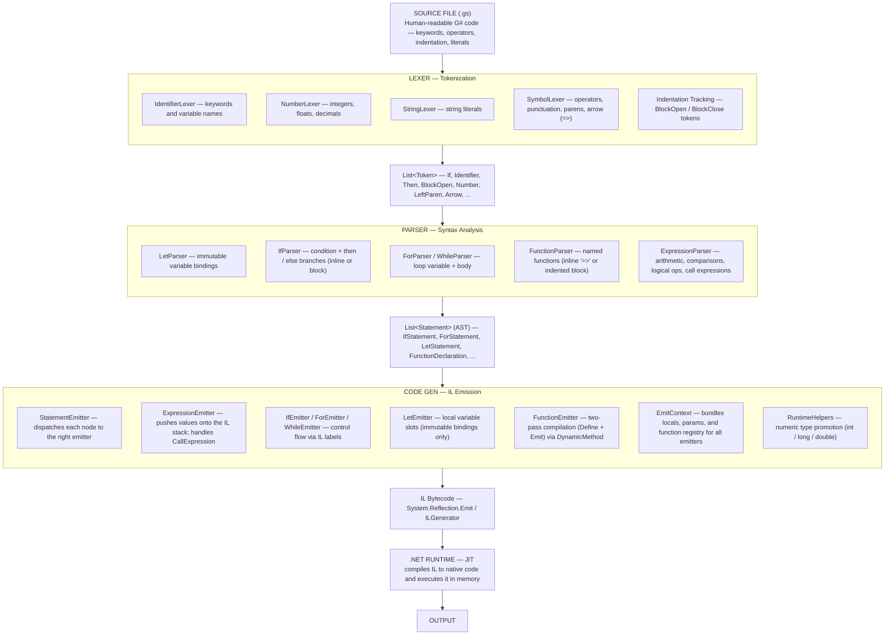

# G♯

G♯ is a purely functional programming language that emits IL (Intermediate Language) and runs on the .NET runtime.
It's a challenging project, but I'm learning a lot from it. I'm not a language design expert (yet), so you'll likely
find many rough edges and mistakes along the way, and that's totally fine.

This whole thing is meant to be fun, experimental, and educational.

⚠️ This project is in early development. Contributions and feedback are welcome!

---

## Architecture



---

## Current Features

### Implemented

- Lexer and tokenization
- Parser for basic statements
- `println` for printing values
- Immutable variable bindings using `let` (purely functional — no reassignment)
- Dynamic type system
- Numeric literals: `int`, `long`, `double` (`d`), `float` (`f`), `decimal` (`m`)
- Conditionals (`if`, `else`) with `then` — inline or indented block
- Loops (`for`) with `do` — indented block
- Arrays (`[1 2 3]`) with `for` iteration
- User-defined functions — inline (`=>`) and indented block forms
- Function calls with arguments

### Planned / Not Implemented Yet

- Recursion
- Higher-order functions (functions as arguments / return values)
- String concatenation with `+`
- Standard math functions (`abs`, `min`, `max`, `mod`)
- Multiple files / imports
- Error messages with line numbers

---

## Syntax

### Variable Declarations

```gs
let num = 10
let name = "greg"
let isTrue = false
println name
```

---

### Numeric Literals

```gs
let i = 42
let d = 3.14d
let f = 2.5f
let m = 9.99m
```

---

### Arrays

```gs
let nums = [1 2 3 4 5]
let names = ["Alice" "Bob" "Carol"]
```

---

### Conditionals

```gs
# inline
if num >= 20 then println "X" else println "Y"

# block
if num >= 20 then
    println "X"
else
    println "Y"
```

---

### For

```gs
for item in nums do
    println item
```

---

### While

```gs
# while exists in the grammar but is deprecated — it requires mutable state.
# It will be removed once recursion is implemented.
while num < 20 do
    println num
```

---

### Functions

Functions support two forms: **inline** (single expression after `=>`) and **block** (indented body).

```gs
# inline — single statement after =>
greet() => println "Hello!"

# inline with parameters
add(a b) => println a + b

# block form
greet()
    println "Hello!"
    println "How are you?"

# calling a function
greet()
add(3 5)
```

## Contact

If you have questions, suggestions, or just want to talk about language design and .NET internals, feel free to reach
out:

**gregory.wow@hotmail.com**

---

## MIT License

This project is licensed under the [MIT License](LICENSE).
