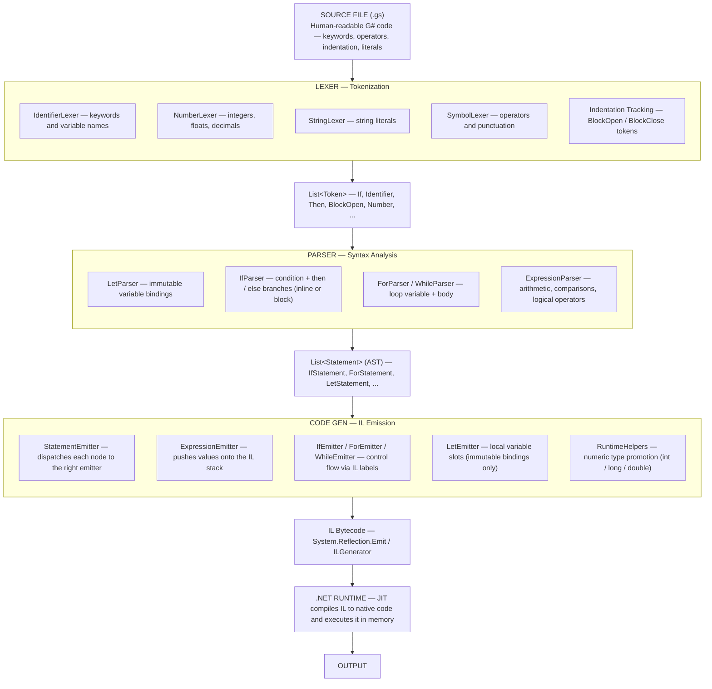

# G♯

G♯ is a purely functional programming language that emits IL (Intermediate Language) and runs on the .NET runtime.
It's a challenging project, but I'm learning a lot from it. I'm not a language design expert (yet), so you'll likely
find many rough edges and mistakes along the way, and that's totally fine.

This whole thing is meant to be fun, experimental, and educational.

⚠️ This project is in early development. Contributions and feedback are welcome!

---

## Architecture



---

## Current Features

### Implemented

- Lexer and tokenization
- Parser for basic statements
- `println` for printing values
- Immutable variable bindings using `let` (purely functional — no reassignment)
- Dynamic type system
- Conditionals (`if`, `else`) with `then` — inline or indented block
- Loops (`for`, `while`) with `do` — indented block

### In Progress / Not Implemented Yet

- Functions with parameters and return types
- Object types with constructor-based instantiation

---

This is the current plan for a first version of the language, a minimal but expressive set of features.

### Variable Declarations

```gsharp
let num = 10
let name = "Gregori"
let isTrue = false
println name
```

---

### Arrays

```gsharp
let array = [1 2 3 4 5 6 7 8 9 10]
array[10] = 90
```

---

### Conditionals

```gsharp
# inline
if num >= 20 then println "X" else println "Y"

# block
if num >= 20 then
    println "X"
else
    println "Y"
```

---

### While

```gsharp
# while exists in the grammar but is deprecated — it requires mutable state.
# It will be removed once recursion is implemented.
while num < 20 do
    println num
```

### For

```gsharp
for item in array do
    println item
```

### Functions (planned)

```gsharp
function Sum(a b) {
    return a + b
}

function Greet() {
    println "Hello!"
}
```

---

### Object with Constructor (planned)

```gsharp
object Person(name, age) {
    function SayHello() {
        println "Hello, my name is " + name
    }

    function IsAdult() {
        return age >= 18
    }
}

let p = new Person("Gregori", 20)
p.SayHello()
```

## Contact

If you have questions, suggestions, or just want to talk about language design and .NET internals, feel free to reach
out:

**gregory.wow@hotmail.com**

---

## MIT License

This project is licensed under the [MIT License](LICENSE).
