# G♯

G♯ is a purely functional programming language that compiles to .NET IL and runs on the .NET runtime.
Everything is an expression, all bindings are immutable, and there is no reassignment.

This is an experimental, educational project. Expect rough edges.

⚠️ Early development — contributions and feedback welcome.

---

## Getting Started

### Install the CLI

```bash
dotnet tool install -g --add-source ./nupkg GSharp.CLI
```

### Run a file

```bash
gs run main.gs     # explicit
gs run             # auto-detects entry point in the current directory
gs hello.gs        # shorthand
```

---

## Syntax

### Let bindings

Bindings are immutable. There is no reassignment.

```gs
let name = "Alice"
let age  = 30
let pi   = 3.14d
println name
```

### Numeric types

```gs
let i = 42       // int
let d = 3.14d    // double
let f = 2.5f     // float
let m = 9.99m    // decimal
```

### Arrays

```gs
let nums  = [1 2 3 4 5]
let names = ["Alice" "Bob" "Carol"]
```

### Conditionals

`if` is an expression — it can appear on the right side of `let`.

```gs
// inline
if age >= 18 then println "adult" else println "minor"

// block
if age >= 18 then
    println "adult"
else
    println "minor"

// as expression
let label = if age >= 18 then "adult" else "minor"
println label
```

### For — functional map

`for` transforms a collection and returns a new array.
The last expression in the body is the value for each element.

```gs
let nums    = [1 2 3 4 5]
let doubled = for item in nums do
    item * 2

for x in doubled do
    println x    // 2 4 6 8 10
```

### Comments

```gs
// this is a comment
let x = 10    // inline comment
```

---

### Built-in functions

#### Array operations

```gs
let nums = [1 2 3 4 5]

println head nums        // 1
println last nums        // 5
println len nums         // 5
println empty nums       // False
println nth nums 2       // 3  (zero-indexed)

let rest     = tail nums         // [2 3 4 5]
let reversed = reverse nums      // [5 4 3 2 1]
let more     = [6 7 8]
let all      = concat nums more  // [1 2 3 4 5 6 7 8]
```

#### Type conversion

```gs
println str 42       // "42"
println str 3.14d    // "3.14"
```

---

### Functions

No parentheses in definitions. Two forms: inline (`=>`) and block (indented body).
The last expression in a block is the implicit return value.

```gs
// inline
double x => x * 2
add a b  => a + b
greet    => println "Hello!"

// block — last expression is returned
max a b
    if a >= b then a else b
```

### Function calls

No parentheses needed when arguments are simple values (literals or variable names).
Parentheses are required when an argument is an expression.

```gs
println double 5        // 10
println add 3 7         // 10
println max 100 42      // 100

// parentheses required for expression arguments
// `factorial n - 1` would parse as `(factorial n) - 1` — wrong
factorial n
    if n == 0 then 1 else n * factorial(n - 1)

println factorial 10    // 3628800
```

### Recursion

```gs
fib n
    if n <= 1 then n else fib(n - 1) + fib(n - 2)

println fib 10    // 55
```

### Higher-order functions

Functions are first-class values — pass them, store them, return them.

```gs
double x       => x * 2
apply f x      => f(x)
applyTwice f x => f(f(x))

println apply double 5        // 10
println applyTwice double 3   // 12

let fn = double
println fn(10)                // 20
```

---

### Entry point

For a single-file program, the file itself is the entry point — everything runs top-to-bottom.

For multi-file programs, declare `main` as the entry point. Exactly one file must have `main`.

```gs
add a b => a + b

main
    let result = add 10 20
    println result
```

---

### Modules and imports

A module is any `.gs` file without a `main` declaration. Import it by name — no path needed.
Module names must be unique across the project.

```gs
// mathutils.gs
add a b => a + b
square x => x * x
```

```gs
// main.gs
import mathutils

main
    println mathutils.add 3 5      // 8
    println mathutils.square 4     // 16
```

Module files can be placed in any subdirectory. The compiler finds them by name.
Modules can import other modules — circular imports are detected and reported as errors.

---

## Current Features

| Feature | Status |
|---|---|
| Immutable bindings (`let`) | ✅ |
| Numeric types (int, float, double, decimal) | ✅ |
| Strings | ✅ |
| Arrays | ✅ |
| `if/else` as expression (inline and block) | ✅ |
| `for` as functional map (returns array) | ✅ |
| Named functions (inline `=>` and block) | ✅ |
| No-paren function calls | ✅ |
| Recursion | ✅ |
| Higher-order functions | ✅ |
| Line comments (`//`) | ✅ |
| `main` as entry point | ✅ |
| `gs run` CLI with auto-detection | ✅ |
| Built-in array functions (`head`, `tail`, `last`, `len`, `nth`, `reverse`, `concat`) | ✅ |
| Type conversion (`str`) | ✅ |
| Module import system (`import`, dot notation) | ✅ |
| Multi-file projects with recursive module loading | ✅ |
| Circular import detection | ✅ |
| String concatenation (`+`) | ⏳ |
| Lambda expressions | ⏳ |
| `map` / `filter` / `fold` | ⏳ |
| .NET interop (`import dotnet`) | ⏳ |
| Hindley-Milner type inference | ✅ |
| Pattern matching | ⏳ |

---

## Contact

**gregory.wow@hotmail.com**

---

## License

[MIT](LICENSE)

---

## Architecture

```mermaid
flowchart TD
    SRC["SOURCE FILE (.gs)"]

    subgraph LEXER["LEXER"]
        L1["IdentifierLexer — keywords and names"]
        L2["NumberLexer — int, float, double, decimal"]
        L3["StringLexer — string literals"]
        L4["SymbolLexer — operators, arrow (=>)"]
        L5["Indentation — BlockOpen / BlockClose tokens"]
    end

    T["List&lt;Token&gt;"]

    subgraph PARSER["PARSER"]
        P1["LetParser — immutable bindings"]
        P2["IfParser — inline or block conditionals"]
        P3["ForParser — functional map over arrays"]
        P4["FunctionParser — named functions"]
        P5["ImportParser — module declarations"]
        P6["ExpressionParser — arithmetic, calls, HOF"]
    end

    AST["List&lt;Expression&gt; (AST)"]

    subgraph CLI["CLI"]
        CL1["EntryResolver — detects entry point file"]
        CL2["GsLoader — parses files, loads modules via queue"]
    end

    subgraph TYPECHECKER["TYPE CHECKER"]
        TC1["TypeInferrer — walks AST, assigns TypeVars, generates constraints"]
        TC2["Unifier — solves constraints via Robinson unification"]
        TC3["Substitution — maps TypeVar ids to resolved concrete types"]
    end

    TMAP["Dictionary&lt;Expression, GsType&gt; (type map)"]

    subgraph CODEGEN["CODE GEN"]
        C1["ExpressionEmitter — typed IL (native int/double) or boxed object fallback"]
        C2["IfEmitter / ForEmitter — control flow via IL labels"]
        C3["LetEmitter — typed local slots (int, double, etc.)"]
        C4["FunctionEmitter — two-pass (Define + Emit) with adapter methods"]
        C5["EmitContext — locals, params, functions, adapters, type map"]
        C6["GSharpFunction — first-class function wrapper"]
        C7["RuntimeHelpers — numeric type promotion (fallback)"]
        C8["PrecompiledFunctions — built-in array and conversion functions"]
    end

    IL["IL — System.Reflection.Emit"]
    RT[".NET Runtime"]
    OUT["Output"]

    SRC --> CLI --> LEXER --> T --> PARSER --> AST --> TYPECHECKER --> TMAP --> CODEGEN --> IL --> RT --> OUT
```



### Project structure

```
GSharp.Lexer/         — tokenizer (Lexer, sub-lexers, TokenType)
GSharp.AST/           — immutable record types for all AST nodes
  Expression.cs       — base + Literal, Binding, Binary
  Declarations.cs     — FunctionDeclaration, ImportDeclaration
  Calls.cs            — CallExpression, QualifiedCallExpression
  Statements.cs       — Let, Print, If, For
GSharp.Parser/        — recursive-descent parser (one class per statement type)
GSharp.TypeChecker/   — Hindley-Milner type inference
  GsType.cs           — type hierarchy (IntType, FunctionType, TypeVar, ...)
  TypeInferrer.cs     — walks AST, assigns TypeVars, collects constraints
  Unifier.cs          — Robinson unification algorithm
  Substitution.cs     — TypeVar → GsType mapping produced by the Unifier
  TypeEnvironment.cs  — scoped variable → type bindings
  TypeConstraint.cs   — equality constraint (A must equal B)
GSharp.CodeGen/       — IL emitters (one class per statement type) + Compiler entry point
GSharp.CLI/           — entry point resolver, file loader, program runner
  EntryResolver.cs    — detects which file to run
  GsLoader.cs         — parses files and resolves module imports
  Program.cs          — main entry point
GSharp.Tests/         — xUnit tests (FluentAssertions)
```

---

## Type System

G# uses **Hindley-Milner type inference** — the compiler infers the type of every expression
without requiring annotations. Type errors are caught before any IL is emitted.

### Types

| G# type | Example |
|---|---|
| `int` | `42` |
| `float` | `2.5f` |
| `double` | `3.14d` |
| `decimal` | `9.99m` |
| `string` | `"hello"` |
| `bool` | `true` |
| `unit` | result of `println`, `for`, `let` |
| `[int]` | `[1 2 3]` |
| `(int → int)` | `double x => x * 2` |

### Compile-time errors

The type checker runs before the compiler emits any IL. If the program is ill-typed,
it fails with an error and no code is generated.

```gs
// int + string — caught at compile time
let x = 10 + "hello"
// → type mismatch: expected 'int', got 'string'

// if branches return different types
let flag = true
let result = if flag then 1 else "text"
// → type mismatch: expected 'int', got 'string'
```

### How it works

The type checker runs in three phases.

**Phase 1 — Inference.** The `TypeInferrer` walks the AST and assigns a type to every
expression. When the type is not yet known (e.g. the result of `a + b` before the
operands are resolved), a fresh _type variable_ is created as a placeholder (`?0`, `?1`, …).
As sub-expressions are visited, _constraints_ are collected — equality requirements
between types.

```
let x = 10          →  x : IntType
let y = x + 5       →  resultType = ?0
                        constraints: [ IntType == IntType,  ?0 == IntType ]
println y           →  UnitType
```

**Phase 2 — Unification.** The `Unifier` solves all constraints using Robinson's
unification algorithm. It processes each constraint in a queue:

- If both sides are equal → discard (nothing to do).
- If one side is a type variable → bind it: `?0 → IntType`.
- If both sides are `FunctionType` → decompose into two smaller constraints.
- If both sides are incompatible concrete types (`int` vs `string`) → **type error**.

```
Constraint: ?0 == IntType
Action:     bind ?0 → IntType
Result:     Substitution { "0" → IntType }
```

**Phase 3 — Resolution.** The `Substitution` is applied to every expression in the map.
Any `?0` that was a placeholder becomes its resolved type. The result is a
`Dictionary<Expression, GsType>` that maps every AST node to its final concrete type.

```
BinaryExpression(x + 5)  →  was ?0,  now IntType
LetExpression("y")        →  was ?0,  now IntType
```

### Typed code generation

The resolved type map is passed to the `Compiler`. The `ExpressionEmitter` uses it to
emit more efficient IL for expressions with known types.

```
// let x = 10 — typed local, no heap allocation
Ldc_I4   10       // push int32 literal
Stloc    x        // store in int32 local slot  (no boxing)

// let z = x + y — direct Add opcode, no RuntimeHelpers
Ldloc    x        // push int32
Ldloc    y        // push int32
Add               // native integer add
Stloc    z        // store in int32 local slot

// println z — box only when required by the consumer
Ldloc    z
Box      int32
Call     Console.WriteLine(object)
```

When types are not known statically (function parameters, loop variables, dynamic calls),
the emitter falls back to `RuntimeHelpers` with boxed `object` values — the same
behavior as before the type checker was introduced.
