# G♯

G♯ is a purely functional programming language that compiles to .NET IL and runs on the .NET runtime.
Everything is an expression, all bindings are immutable, and there is no reassignment.

This is an experimental, educational project. Expect rough edges.

⚠️ Early development — contributions and feedback welcome.

---

## Getting Started

### Install the CLI

```bash
dotnet tool install -g --add-source ./nupkg GSharp.CLI
```

### Run a file

```bash
gs run main.gs     # explicit
gs run             # auto-detects main.gs or the single .gs file in the directory
gs hello.gs        # shorthand
```

---

## Architecture

```mermaid
flowchart TD
    SRC["SOURCE FILE (.gs)"]

    subgraph LEXER["LEXER"]
        L1["IdentifierLexer — keywords and names"]
        L2["NumberLexer — int, float, double, decimal"]
        L3["StringLexer — string literals"]
        L4["SymbolLexer — operators, arrow (=>)"]
        L5["Indentation — BlockOpen / BlockClose tokens"]
    end

    T["List&lt;Token&gt;"]

    subgraph PARSER["PARSER"]
        P1["LetParser — immutable bindings"]
        P2["IfParser — inline or block conditionals"]
        P3["ForParser — functional map over arrays"]
        P4["FunctionParser — named functions"]
        P5["ExpressionParser — arithmetic, calls, HOF"]
    end

    AST["List&lt;Expression&gt; (AST)"]

    subgraph CODEGEN["CODE GEN"]
        C1["ExpressionEmitter — one boxed object per expression on IL stack"]
        C2["IfEmitter / ForEmitter — control flow via IL labels"]
        C3["LetEmitter — immutable local slots"]
        C4["FunctionEmitter — two-pass (Define + Emit) with adapter methods"]
        C5["EmitContext — locals, params, functions, adapters"]
        C6["GSharpFunction — first-class function wrapper"]
        C7["RuntimeHelpers — numeric type promotion"]
    end

    IL["IL — System.Reflection.Emit"]
    RT[".NET Runtime"]
    OUT["Output"]

    SRC --> LEXER --> T --> PARSER --> AST --> CODEGEN --> IL --> RT --> OUT
```



---

## Syntax

### Let bindings

Bindings are immutable. There is no reassignment.

```gs
let name = "Alice"
let age  = 30
let pi   = 3.14d
println name
```

### Numeric types

```gs
let i = 42       // int
let d = 3.14d    // double
let f = 2.5f     // float
let m = 9.99m    // decimal
```

### Arrays

```gs
let nums  = [1 2 3 4 5]
let names = ["Alice" "Bob" "Carol"]
```

### Conditionals

`if` is an expression — it can appear on the right side of `let`.

```gs
// inline
if age >= 18 then println "adult" else println "minor"

// block
if age >= 18 then
    println "adult"
else
    println "minor"

// as expression
let label = if age >= 18 then "adult" else "minor"
println label
```

### For — functional map

`for` transforms a collection and returns a new array.
The last expression in the body is the value for each element.

```gs
let nums    = [1 2 3 4 5]
let doubled = for item in nums do
    item * 2

for x in doubled do
    println x    // 2 4 6 8 10
```

### Comments

```gs
// this is a comment
let x = 10    // inline comment
```

---

### Functions

No parentheses in definitions. Two forms: inline (`=>`) and block (indented body).
The last expression in a block is the implicit return value.

```gs
// inline
double x => x * 2
add a b  => a + b
greet    => println "Hello!"

// block — last expression is returned
max a b
    if a >= b then a else b
```

### Function calls

No parentheses needed when arguments are simple values (literals or variable names).
Parentheses are required when an argument is an expression.

```gs
println double 5        // 10
println add 3 7         // 10
println max 100 42      // 100

// parentheses required for expression arguments
// `factorial n - 1` would parse as `(factorial n) - 1` — wrong
factorial n
    if n == 0 then 1 else n * factorial(n - 1)

println factorial 10    // 3628800
```

### Recursion

```gs
fib n
    if n <= 1 then n else fib(n - 1) + fib(n - 2)

println fib 10    // 55
```

### Higher-order functions

Functions are first-class values — pass them, store them, return them.

```gs
double x    => x * 2
apply f x   => f(x)
applyTwice f x => f(f(x))

println apply double 5        // 10
println applyTwice double 3   // 12

let fn = double
println fn(10)                // 20
```

---

### Entry point

For a single-file program, the file itself is the entry point — everything runs top-to-bottom.

For multi-file programs (when imports arrive), declare `main` as the entry point.
`main` is a reserved word.

```gs
// main.gs
add a b => a + b

main
    let result = add 10 20
    println result
```

---

## Current Features

| Feature | Status |
|---|---|
| Immutable bindings (`let`) | ✅ |
| Numeric types (int, float, double, decimal) | ✅ |
| Strings | ✅ |
| Arrays | ✅ |
| `if/else` as expression (inline and block) | ✅ |
| `for` as functional map (returns array) | ✅ |
| Named functions (inline `=>` and block) | ✅ |
| No-paren function calls | ✅ |
| Recursion | ✅ |
| Higher-order functions | ✅ |
| Line comments (`//`) | ✅ |
| Error messages with line numbers | ✅ |
| `main` as entry point | ✅ |
| `gs run` CLI with auto-detection | ✅ |
| VS Code extension (highlight + run) | ✅ |
| String concatenation (`+`) | ⏳ |
| Lambda expressions | ⏳ |
| `map` / `filter` / `fold` | ⏳ |
| Built-in functions (`len`, `str`, `int`) | ⏳ |
| Multiple files / imports | ⏳ |
| Type system (Hindley-Milner inference) | ⏳ |
| Pattern matching | ⏳ |

---

## Contact

**gregory.wow@hotmail.com**

---

## License

[MIT](LICENSE)
