# Architecture

## Pipeline overview

```mermaid
flowchart TD
    SRC["SOURCE FILE (.gs)"]

    subgraph LEXER["LEXER"]
        L1["IdentifierLexer — keywords and names"]
        L2["NumberLexer — int, float, double, decimal"]
        L3["StringLexer — string literals"]
        L4["SymbolLexer — operators, arrows (-> and =>)"]
        L5["Indentation — BlockOpen / BlockClose tokens"]
    end

    T["List&lt;Token&gt;"]

    subgraph PARSER["PARSER (one Parser class, one method per construct)"]
        P1["ParseBinding / ParsePrint / ParseIf / ParseFor / ParseFunction / ParseImport"]
        P2["GetExpression / ParseExpression / ParseRightOperand — arithmetic, unary, calls, HOF, logical"]
    end

    AST["List&lt;Expression&gt; (AST)"]

    subgraph CLI["CLI"]
        CL1["EntryResolver — detects entry point file"]
        CL2["GsLoader — parses files, loads modules via queue"]
    end

    subgraph OPTIMIZER["OPTIMIZER"]
        O1["ConstantFolder.FoldAll — evaluates literal-only expressions at compile time"]
    end

    FOLDED["List&lt;Expression&gt; (folded AST)"]

    subgraph TYPECHECKER["TYPE CHECKER"]
        TC1["TypeInferrer — walks AST, assigns TypeVars, generates constraints"]
        TC2["Unifier — solves constraints via Robinson unification"]
        TC3["Substitution — maps TypeVar ids to resolved concrete types"]
    end

    TMAP["Dictionary&lt;Expression, GsType&gt; (type map)"]

    subgraph CODEGEN["CODE GEN (one ExpressionEmitter class, one method per construct)"]
        C1["Emit / EmitBinary / EmitUnary — typed IL (native int/double) or boxed object fallback"]
        C2["EmitIf / EmitFor — control flow via IL labels"]
        C3["EmitBindingDeclaration — typed local slots (int, double, etc.)"]
        C4["DefineFunction + EmitFunction — two-pass, with adapter methods; typed params"]
        C5["EmitTail / TryEmitTailCall — self-tail-calls as Starg_S + Br (no new stack frame)"]
        C6["EmitContext — locals, params, functions, adapters, type map, param types"]
        C7["GSharpFunction — first-class function wrapper"]
        C8["RuntimeHelpers — numeric type promotion (fallback)"]
    end

    subgraph STDLIB["STANDARD LIBRARY"]
        S1["ArrayBuiltins — array.head, array.sort, array.map, ..."]
        S2["StringBuiltins — string.from, ..."]
        S3["GSharpFunction — first-class function runtime wrapper"]
    end

    subgraph LSP["LANGUAGE SERVER"]
        LS1["TextDocumentHandler — receives document open/change events"]
        LS2["DocumentAnalyzer — runs Lexer → Parser → TypeInferrer, collects errors"]
        LS3["HoverProvider — maps cursor position to inferred type"]
        LS4["DocumentStore — caches latest analysis per document"]
    end

    IL["IL — System.Reflection.Emit"]
    RT[".NET Runtime"]
    OUT["Output"]
    EDITOR["Editor (LSP client)"]

    SRC --> CLI --> LEXER --> T --> PARSER --> AST --> OPTIMIZER --> FOLDED --> TYPECHECKER --> TMAP --> CODEGEN --> IL --> RT --> OUT
    STDLIB --> TYPECHECKER
    STDLIB --> CODEGEN
    EDITOR --> LSP --> TYPECHECKER
```



## Project structure

The compiler is one project, `GSharp.Compiler`, with a folder (and matching namespace) per
layer — there's no per-layer project split, and no per-construct class split either (the
parser is a single `Parser` class with one method per construct, codegen is a single
`ExpressionEmitter` class the same way):

```
GSharp.Compiler/
  Lexer/                — tokenizer
    Lexer.cs            — Lexer class, indentation → BlockOpen/BlockClose
    Token.cs            — TokenType enum
    Helpers/             — SymbolTokenMap, keyword map, constants
  AST/                  — immutable record types for all AST nodes
    Expression.cs       — base + Literal, Identifier, Binary, Unary, Binding, Print, If, For
    Declarations.cs     — FunctionDeclaration, ImportDeclaration
    Calls.cs            — CallExpression, ModuleCallExpression
  Parser/               — recursive-descent parser
    Parser.cs           — one class, one private method per construct (ParseIf, ParseFor, ...)
    Validations.cs      — OperatorPrecedence table, literal-token helpers, number parsing
  Optimizer/            — compile-time-only passes, run before the type checker
    ConstantFolder.cs   — evaluates literal-only expressions (arithmetic, unary, short-circuit)
  TypeChecker/          — Hindley-Milner type inference (partial classes)
    GsType.cs           — type hierarchy (IntType, FunctionType, TypeVar, ...)
    TypeInferrer.cs     — walks AST, assigns TypeVars, collects constraints
    TypeInferrer.Expressions.cs — per-node inference (binary, unary, if, for, ...)
    TypeInferrer.Functions.cs   — function signature registration and calls
    TypeInferrer.Builtins.cs    — BuiltinTypeRules: arities and signatures for stdlib builtins
    Unifier.cs          — Robinson unification algorithm
    Substitution.cs     — TypeVar → GsType mapping produced by the Unifier
    TypeEnvironment.cs  — scoped variable → type bindings
    TypeConstraint.cs   — equality constraint (A must equal B)
  Stdlib/               — standard library implementations
    ArrayBuiltins.cs    — array.head, array.tail, array.sort, array.map, ...
    StringBuiltins.cs   — string.from, ...
  CodeGen/              — IL emission
    ExpressionEmitter.cs — one class, one private method per construct (EmitIf, EmitFor, ...)
    Compiler.cs         — builds the dynamic assembly, drives DefineFunction/EmitFunction, runs it
    EmitContext.cs      — locals, params, functions, adapters, type map, param types
    Helpers/
      RuntimeHelpers.cs — boxed numeric fallback (Add, Subtract, Negate, promotion, ...)
      GSharpFunction.cs — first-class function runtime wrapper
GSharp.LanguageServer/  — LSP server (hover, diagnostics) — separate project
  DocumentAnalyzer.cs   — runs Lexer → Parser → TypeInferrer over in-memory source (no ConstantFolder)
  HoverProvider.cs      — maps cursor position to the inferred type of the node under it
  HoverHandler.cs       — LSP hover request handler
  TextDocumentHandler.cs — LSP text document sync handler
  DocumentStore.cs      — per-document analysis cache
  TypeDisplay.cs        — formats GsType values for display in hover tooltips
GSharp.CLI/             — entry point resolver, file loader, program runner — separate project
  EntryResolver.cs      — detects which file to run
  GsLoader.cs           — parses files and resolves module imports
  Program.cs            — main entry point; runs Lexer → Parser → ConstantFolder → TypeInferrer → Compiler
GSharp.Tests/           — xUnit tests (FluentAssertions) — separate project, folders mirror GSharp.Compiler's
```

---

## Type System

G# uses **Hindley-Milner type inference** — the compiler infers the type of every expression
without requiring annotations. Type errors are caught before any IL is emitted.

### Types

| G# type | Example |
|---|---|
| `int` | `42` |
| `float` | `2.5f` |
| `double` | `3.14d` |
| `decimal` | `9.99m` |
| `string` | `"hello"` |
| `bool` | `true` |
| `unit` | result of `println`, `for`, bindings |
| `[int]` | `[1 2 3]` |
| `(int → int)` | `double x => x * 2` |

### Compile-time errors

The type checker runs before the compiler emits any IL. If the program is ill-typed,
it fails with an error and no code is generated.

```gs
// int + string — caught at compile time
x -> 10 + "hello"
// → type mismatch: expected 'int', got 'string'

// if branches return different types
flag   -> true
result -> if flag then 1 else "text"
// → type mismatch: expected 'int', got 'string'
```

### How it works

The type checker runs in three phases.

**Phase 1 — Inference.** The `TypeInferrer` walks the AST and assigns a type to every
expression. When the type is not yet known (e.g. the result of `a + b` before the
operands are resolved), a fresh _type variable_ is created as a placeholder (`?0`, `?1`, …).
As sub-expressions are visited, _constraints_ are collected — equality requirements
between types.

```
x -> 10          →  x : IntType
y -> x + 5       →  resultType = ?0
                     constraints: [ IntType == IntType,  ?0 == IntType ]
println y        →  UnitType
```

**Phase 2 — Unification.** The `Unifier` solves all constraints using Robinson's
unification algorithm. It processes each constraint in a queue:

- If both sides are equal → discard (nothing to do).
- If one side is a type variable → bind it: `?0 → IntType`.
- If both sides are `FunctionType` → decompose into two smaller constraints.
- If both sides are incompatible concrete types (`int` vs `string`) → **type error**.

```
Constraint: ?0 == IntType
Action:     bind ?0 → IntType
Result:     Substitution { "0" → IntType }
```

**Phase 3 — Resolution.** The `Substitution` is applied to every expression in the map.
Any `?0` that was a placeholder becomes its resolved type. The result is a
`Dictionary<Expression, GsType>` that maps every AST node to its final concrete type.

```
BinaryExpression(x + 5)    →  was ?0,  now IntType
BindingExpression("y")     →  was ?0,  now IntType
```

### Typed code generation

The resolved type map is passed to the `Compiler`. The `ExpressionEmitter` uses it to
emit more efficient IL for expressions with known types.

```
// x -> 10 — typed local, no heap allocation
Ldc_I4   10       // push int32 literal
Stloc    x        // store in int32 local slot  (no boxing)

// z -> x + y — direct Add opcode, no RuntimeHelpers
Ldloc    x        // push int32
Ldloc    y        // push int32
Add               // native integer add
Stloc    z        // store in int32 local slot

// println z — box only when required by the consumer
Ldloc    z
Box      int32
Call     Console.WriteLine(object)
```

Function parameters also receive native CLR types when the type inferrer resolves them.
`add a b => a + b` with `int` arguments emits `Ldarg_0 / Ldarg_1 / Add` — no boxing,
no `RuntimeHelpers`.

When types are not known statically (loop variables, dynamic calls), the emitter falls
back to `RuntimeHelpers` with boxed `object` values.

### Tail-call optimization

Self-recursive functions in tail position are compiled into a loop rather than a
recursive call. This prevents stack overflows for unbounded recursion.

```gs
sum acc n
    if n == 0 then acc else
        a -> acc + n
        b -> n - 1
        sum a b     // ← tail call: reuses the current stack frame
```

```
// instead of: call sum; ret
Starg_S  1     // overwrite param n   with new value
Starg_S  0     // overwrite param acc with new value
Br       start // jump back to top — no new stack frame
```

`if/else` branches are both eligible: TCO propagates into each branch independently.
